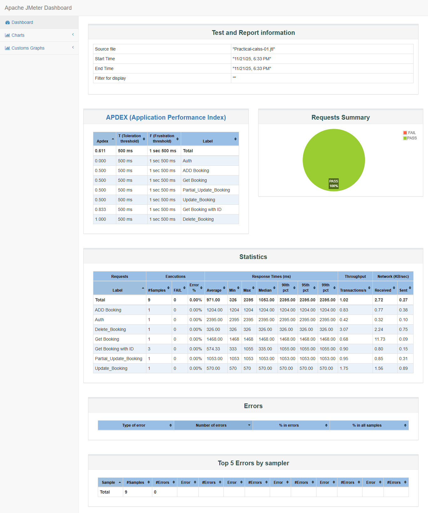
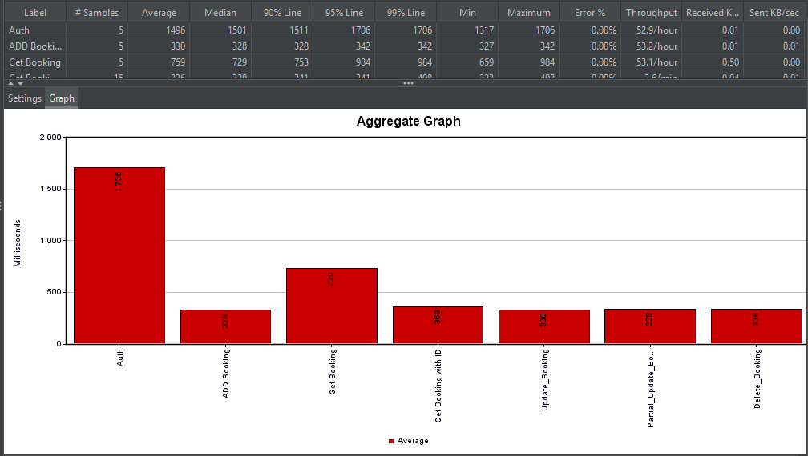
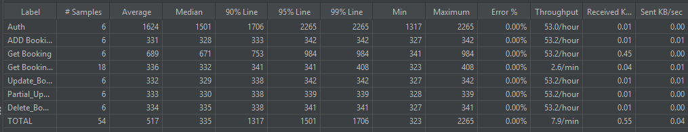
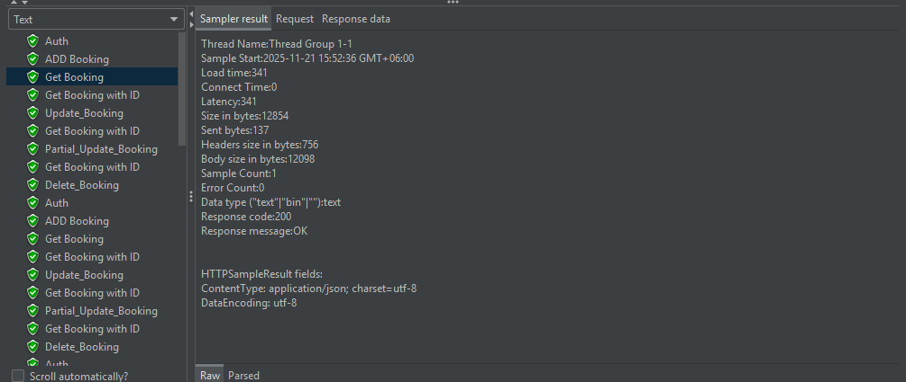
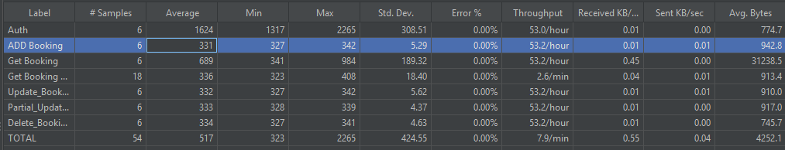
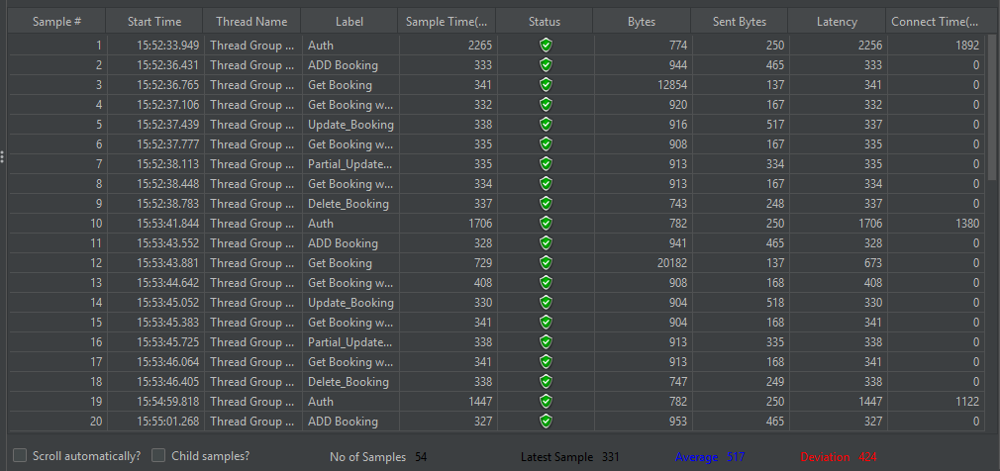

# 🚀 JMeter Performance Testing Project

A complete performance testing framework built using **Apache JMeter**, designed to evaluate system behavior, stability, and scalability under various levels of load.  
This repository includes JMeter test plans, result reports, and visual performance metrics.

---




## 📌 Overview

This project focuses on testing the performance of a sample application (e.g., an e-commerce API or login service) using **Apache JMeter**.  
It includes load testing, stress testing, and endurance testing scenarios, along with detailed reports generated after execution.

The repository contains:

- 📊 Aggregate Graph  
- 📑 Aggregate Report  
- 📄 Summary Report  
- 🌲 View Results Tree  
- 🖼️ Exported html file for reports  

---

## ✨ Features

- Complete JMeter test plan (`.jmx`)
- CLI and GUI execution-ready configuration
- Automatically generated HTML and PNG performance reports
- Clear visualization of:
  - Response times  
  - Throughput  
  - Latency  
  - Error percentage  
  - Server performance trends  

---

## 🛠️ Tech Stack / Tools Used

- **Apache JMeter**
- Java (JDK 8+)
- CSV Data Config (optional for parameterization)
- HTML & PNG reports
- GitHub for version control

---

## 📁 Project Structure
project-root/
│
├── test-plan.jmx
├── results/
│ ├── images/
│ │ ├── aggregate-graph.png
│ │ ├── aggregate-report.png
│ │ ├── summary-report.png
│ │ └── view-results-tree.png
│ ├── reports/
│ └── results.jtl
└── README.md

## ▶️ How to Run the Tests

### **Prerequisites**

Ensure the following are installed:

- **Java JDK 8+**
- **Apache JMeter 5.5+**
- Git (optional)
- System with minimum 4GB RAM

---

### Aggregate Graph


### Aggregate Report


### View Results Tree


### Summary Report


### View Result in Table



### **Setup & Installation**

#### 1️⃣ Clone the repository
```bash
git clone https://github.com/your-username/jmeter-performance-testing.git
cd jmeter-performance-testing


